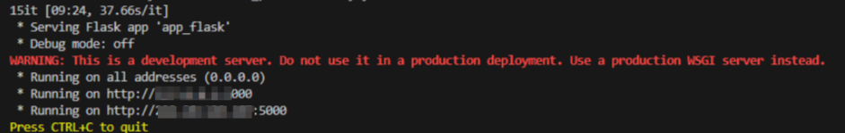

<!--
 * @Descripttion: 
 * @version: V1.0
 * @Author: zyx
 * @Date: 2024-09-20 10:30:24
 * @LastEditors: zyx
 * @LastEditTime: 2024-09-29 09:04:16
-->
# ReadMe to quickly evaluate the model
--------------------------------------------------------------------------------
## Project Overview
--------------------------------------------------------------------------------
The ReadMe Rapid Assessment Model aims to measure the quality of documents through two key dimensions: completeness and clarity. The evaluation of integrity dimension is based on whether the document comprehensively covers the core elements of the project, including project overview, installation guide, user instructions, communication information, and other information that users need to know. This evaluation helps ensure that users have access to all the basic information they need to start using the project.

Clarity focuses on the quality of document expression, including consistency in format, ease of language, and correctness of grammar and spelling. A high-definition document can make it easier for users to understand and follow, thereby enhancing the user experience.
--------------------------------------------------------------------------------

## Feature
--------------------------------------------------------------------------------
### completeness：
1. Project Overview: The README should clearly explain what the project is about, including its goals and the problems it is attempting to solve.
2. Installation guide: The README should include all necessary steps on how to install and configure the project. There should also be a clear list and installation instructions for the required dependencies.
3. Communication information: If users, developers, or contributors need to contact project maintainers, the README should provide the necessary contact information or links.
4. Other information: including whether the paper is cited and whether there are common problem investigations.
### definition：
1. Format effect of the document: Whether the document has a clear structure and layout, including titles, paragraphs, lists, code blocks, etc., so that readers can quickly find the required information.
2. Grammar and spelling errors: Score by checking for grammar and spelling errors.
3. Text readability: Flesch Kincaid readability score. Flesch Reading Ease Score (FRES) and Flesch Kincaid Grade Level (FKGL). These two indicators are based on the average length of sentences and the average number of syllables in words, helping to evaluate the complexity of the text.

--------------------------------------------------------------------------------
##	Installation Guide
--------------------------------------------------------------------------------

1. Environment configuration
First, download the repository source code
'''bash
$ cd botend
$ conda create -n PentestAssistant python=3.10
$ python --version
Python 3.10.13
'''
'''bash
conda activate PentestAssistant
pip install -r requirements.txt 
'''
If pulling dependencies fails, you can replace the conda source, and it is recommended to use Tsinghua Source or University of Science and Technology of China Source

For the front-end and back-end, use Node.js implementation. For specific installation steps, refer to the README.md file in the directory

2. Model Download
The project needs to download two types of models: the dialogue model and the Embedding and Reranker models

Large model
Before the project runs, you need to download and store the local dialogue model in advance, and the common open source model can usually be downloaded from HuggingFace

After downloading the model, you need to modify the environment variables and configure the model address in [app_flask.py] (app_flask.py).

# How to use
'''python
model_deployment = QwenModelDeployment("Qwen1.5-7B")
'''

3. One-click start

'''python
python api_flask.py
'''

--------------------------------------------------------------------------------
## Communicate information

--------------------------------------------------------------------------------
New plugins will be added gradually after this project, if you are interested, you can contact me, zyx72038@hust.edu.cn